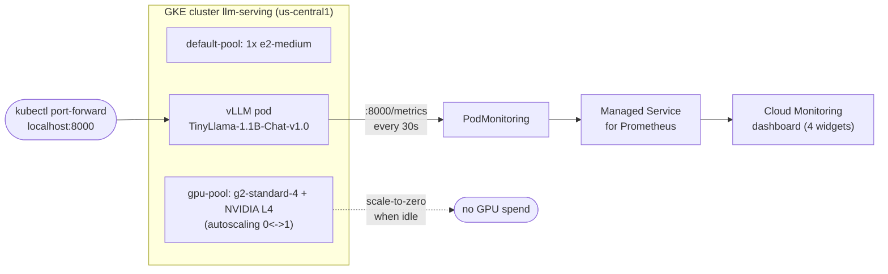

# LLM Inference on GKE — vLLM on NVIDIA L4 GPUs

Production-style LLM serving on Google Kubernetes Engine: vLLM behind health probes,
scraped by Managed Prometheus, watched on a Cloud Monitoring dashboard — with an
autoscaling design driven by **queue depth instead of CPU**.

**The headline finding:** at full inference load, the CPU-based HPA reported **22%**
while the GPU was saturated. CPU is the wrong scaling signal for LLM serving.
Queue depth is the honest one.

## Architecture



## What was built

**Phase 1 — Serving (Sep 25–29)**
- GKE Standard cluster; GPU node pool (`g2-standard-4`, 1× L4) on 0↔1 autoscaling
- vLLM 0.30.0 serving `TinyLlama/TinyLlama-1.1B-Chat-v1.0`, `--max-model-len 2048`,
  ClusterIP Service on :8000 (access via port-forward, no public LB)
- First inference: 60 completion tokens on the L4
- Fixes: `enableServiceLinks: false` (K8s service env injection poisoned vLLM's
  `VLLM_PORT`), `strategy: Recreate` (rolling updates deadlock on a single GPU)
- CPU-HPA experiment: under 6 parallel inference loops, pod CPU rose 11m→171m
  while the HPA reported 22%/70% — CPU is a weak signal for GPU-bound inference

**Phase 2 — Hardening & observability (Oct 2)**
- Startup/readiness/liveness probes on `/health`: new pod held 0/1 for ~3 min
  during model load, flipped to 1/1 when `/health` passed
- `PodMonitoring` scraping `:8000/metrics` every 30s into Managed Prometheus
- 4-widget Cloud Monitoring dashboard: queue depth, running requests, KV-cache %,
  token throughput
- Custom-metric autoscaling **designed, not activated** (see below)

## Key findings

1. **CPU lies about GPU inference load.** HPA said 22%; the GPU was saturated.
   Scale on `vllm:num_requests_waiting` (queue depth), not CPU.
2. **"Running" ≠ "ready" for model servers.** Without probes, the pod reported 1/1
   from container start — minutes before the model could serve.
3. **Google preserves the colon in metric names.**
   `prometheus.googleapis.com/vllm:num_requests_waiting/gauge`, not
   `vllm_num_requests_waiting`. Verify via the descriptors API; never guess.
4. **Counter resets poison rate graphs.** A pod restart zeroes
   `generation_tokens_total`; the resulting "throughput spike" is an artifact.
5. **Honest scope > theatrical demos.** The queue-depth HPA is designed and
   documented, but deliberately not activated: with a single-GPU quota, a second
   replica would sit `Pending` forever.

## Honest scope

- One small model (TinyLlama 1.1B), one L4, no load balancer, no public endpoint
- Autoscaling design is validated conceptually; activation waits on GPU quota
- This is a platform-building exercise, not a production service

## Repo layout

```
k8s/                  Deployment + Service manifests (as applied)
monitoring/           PodMonitoring + dashboard MQL queries
autoscaling/          Queue-depth HPA design (NOT applied — see note inside)
docs/                 Phase write-ups, LinkedIn launch post, demo shot list
```

## Reproduce it

> **Cost warning:** needs a GCP project with billing enabled and L4 quota in
> `us-central1`. The GPU node bills per-second while it exists — **scale the
> deployment to 0 when you're done** (`kubectl scale deploy vllm --replicas=0`)
> and the autoscaler drains the node. The CPU node is the only steady-state cost.

1. `gcloud container clusters create llm-serving --zone us-central1-a ...`
   (or use the console)
2. Add a GPU node pool: `g2-standard-4`, 1× `nvidia-tesla-l4`, autoscaling 0–1
3. `kubectl apply -f k8s/`
4. Wait for 1/1 (`startupProbe` gates readiness during the ~3-min model load)
5. `kubectl port-forward svc/vllm 8000:8000` and run inference against
   `http://localhost:8000/v1/completions`
6. `kubectl apply -f monitoring/podmonitoring.yaml` — metrics flow into Cloud
   Monitoring within ~10 min
7. Park it: `kubectl scale deploy vllm --replicas=0`

## Docs

- `docs/phase-1-llm-serving-gke.pdf` — full build log (21 pages)
- `docs/phase2-observability.md` — probes, Prometheus, dashboard, autoscaling design
- `docs/linkedin-launch-post.md` — the announcement text
- `docs/demo-shot-list.md` — 60–90s demo video plan
